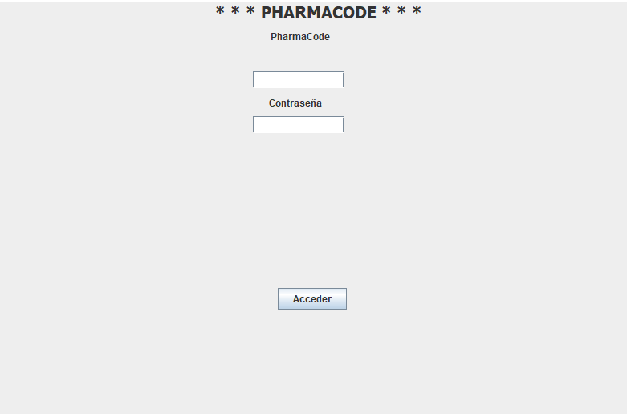

# Proyecto Integrador UEM - MEMORIA 

En esta **repositorio** se subiran todos los archivos relacionados con el Worskspace para el proyecto integrador de la UEM

<!-- @import "[TOC]" {cmd="toc" depthFrom=1 depthTo=6 orderedList=false} -->

<!-- code_chunk_output -->

- [Proyecto Integrador UEM - MEMORIA](#proyecto-integrador-uem-memoria)
  - [Estructura](#estructura)
  - [1. Descripción del proyecto](#1-descripción-del-proyecto)
  - [2. Enfoque](#2-enfoque)
  - [3. Navigación en la aplicación](#3-navigación-en-la-aplicación)
  - [4. Conclusiones](#4-conclusiones)

<!-- /code_chunk_output -->

## Estructura

**Integrantes de PharmaCode:**
- Cloud Master ----- JUN ZHOU
- Scrum Master ----- RUBEN BALBOA
- Designers ------ DIEGO RODRIGUEZ, JAIME ORTIGOSA

## 1. Descripción del proyecto
PharmaCode es un software desarrollado en Java usando la biblioteca Swing.
Se trata de una aplicación de escritorio backoffice dirigida a satisfacer las necesidades del sector farmacéutico en todo lo relativo a la gestión de una farmacia.

Como vemos en el siguiente diagrama de casos de uso, tendremos dos actores; por un lado, el empleado y por otro el administrador.

## 2. Enfoque
El equipo de PharmaCode ha querido orientar la aplicación a la facilidad de uso para que todo sea autodescriptivo y sin pérdidas para el usuario final.
El objetivo de la aplicación es que los usuarios puedan administrar tanto proveedores, productos como ventas de la farmacia con la máxima facilidad.

La aplicación consta de un menú principal que de despliega en submenús con los diferentes paneles a los que puede acceder el usuario y, de esa forma, acceder a las diferentes áreas de la aplicación.

Como resultado de este objetivo, el usuario puede recorrer la aplicación y encontrar la información deseada de forma rápida.

Para desarrollar la misma, hemos utilizado el patrón MVC y, así, tener el objetivo de cada clase dividido para poder favorecer a la modularización, favorecer la realización de pruebas unitarias, hacer una aplicación más limpia y mantenible en el tiempo.

En lo relativo a los datos, hemos utilizado una BBDD relacional alojada en SQLite de forma local para dotar a la aplicación con información suficiente para poder trabajar.
Aquí vemos el modelo relacional de la aplicación:

## 3. Navigación en la aplicación
Lo que se puede observar en la aplicación es que, al abrir la aplicación, el usuario se encuentra en la pantalla de login:

Al entrar, el usuario tendrá la vista de un menú principal:

Cada uno de los elementos del menú, despliega un submenú con los paneles correspondientes a cada área de la aplicación:

Esta distribución de paneles facilita la navegación entre las diferentes áreas de la aplicación y permite que el usuario sepa a que área está accediendo sin nignún tipo de distracción.
Aquí tenemos un ejemplo de cómo se vería uno de los paneles de la aplicación:

## 4. Conclusiones
En definitiva desde PharmaCode hemos desarrollado una aplicación de escritorio que permite la gestión de una farmacia de forma rápida y sencilla, destinado a todo tipo de farmacias. 

